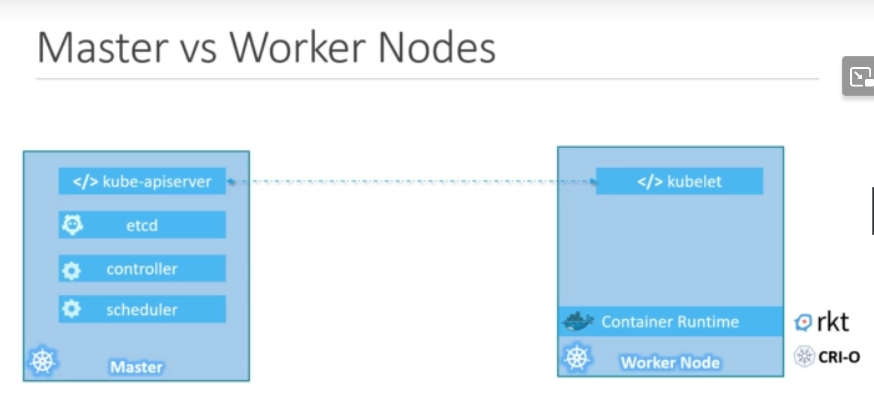
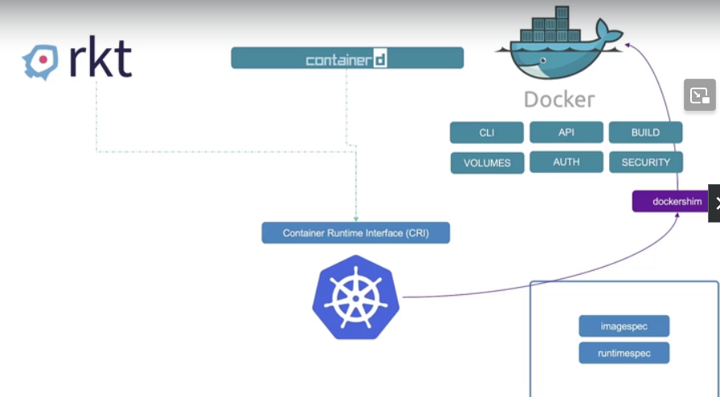
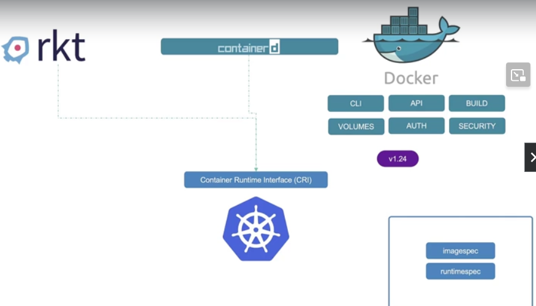
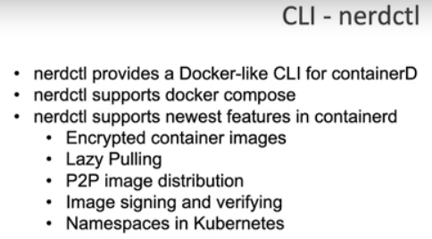
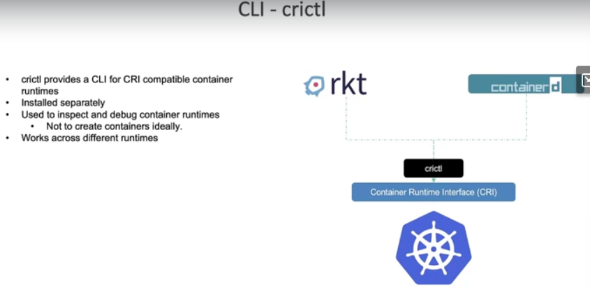
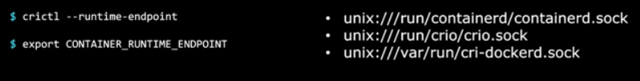
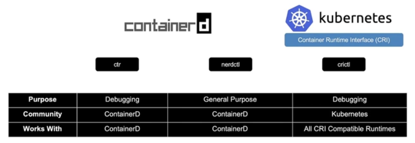

Course objectives
1. Core concepts
  a. Kubernetes Architecture
  b. Create and Configure Pods
2. Configuration
  a. ConfigMaps
  b. SecurityContexts
  c. Resource Requirements
  d. Secrets
  e. ServiceAccounts
3. Multi-Container Pods
  a. Ambassador
  b. Adapter
  c. Sidecar
4. Observability
  a. Readiness and Liveness Probes
  b. Container Logging
  c. Monitor and Debug Applications 
5. Pod Design
  a. Labels, Selectors and Annotations
  b. Rolling Updates & Rollbacks in Deployments
  c. Jobs and CronJobs
6. Services & Networking
  a. Understand Services
  b. Network Policies
7. State Persistence
  a. Persistent Volumes
  b. Persistent Volume Claims


### Node
AKA Minions
A node is a machine, physical or virtual on which kubernetes is installed
A node is also a worker machine, where containers is being launched by kubernetes

### Cluster
A group of nodes
If one node fails, still have other nodes
Sharing load
1 control plane, multiple compute machines (or nodes)

### Master
A Master node has kubernetes installed
Manage the ochestrations of worker nodes

### Kubernetes components
When you install kubernetes, it installs these components
1. API Server
  - FE for Kubernetes
  - Users, Management devices, CLI all talk to API server to interact (with the cluster)
2. etcd (key store)
  - Distributed, reliable key value store used to store all data to manage the cluster
  - for e.g., when you have multiple nodes (and multiple masters) in your cluster, etcd stores all information in the cluster in distributed manner
  - responsible for implementing locks (to ensure no conflicts between masters)
3. Scheduler
  - Distributing work / containers across multiple nodes
  - Assign newly created containers to nodes
4. Controllers
  - Brain behind orchestration
  - Responsible for noticing and responding when nodes, containers or endpoints go down
  - Bring up new containers in case of failure
5. Container runtime 
  - Underlying software to run containers
  - i.e. Docker, rkt or cri-o
6. Kubelet
  - Agent that runs on each node in the cluster
  - Ensure nodes are running as expected

### Master vs Worker Nodes


### kubectl
- Deploy, manage application on kubernetes cluster
- get cluster info, etc

- kubectl run hello-minikube
- kubectl cluster-info
- kubectl get nodes 

### docker vs containerd
pre 1.24


after 1.24


containerD was the daemon in Docker which manged the Run C container runtime 
containerD is CRI-compatible, which Docker is not
Docker shim was removed after from v1.24 onwards

All the docker images that were built before v1.24 can still run because they follow OCI imagespec

containerD is now a separate project from Docker

ctr - comes with containerd, not very user friendly
  - ctr images pull docker.io/library/redis:alpine
  - ctr run docker.io/library/redis:alpine redis
nerdctl ⭐ - more user friendly - works as stand-in replacement to docker-cli
  
   - can run all docker commands
   - nerdctl run --name redis redis:alpine
   - nerdctl run --name webserver -p 80:80 -d nginx
crictl
  - cli from the kubernetes perspective
  - to inteface with Container Runtime Interface (CRI) compatible container runtimes
  - used to inspect and debug container runtimes
  - crictl pull busybox
  - crictl images
  - crictl ps -a 
  - crictl exec -i -t <id> ls
  - crictl logs <id> 
  - crictl pods
  
  

  #### Summary
  


### POD
- Kubernetes does not deploy containers
- The containers are encapsulated in a Kubernetes object known as pods
- A pod is the single instance of an application
- A pod is the smallest object you can create with Kubernetes

[Simplest Pod](./simplest_pod.png)
A kubernetes cluster with a single instance of your application running in a single Docker container, encapsulatd in a Pod

To scale up, you create new Pods

We can also have POD with multiple containers
  - usually of a main application and helper containers (co-dependent)
  - will be brought up and down together
  ### Multiple Containers POD
  [Multi Container PODs](./Multi-container-pods.png)


  ### YAML
 [YAML for POD definition](./pod-definition.yml.png)
 apiVersion, kind, metadata and spec are required
 metadata, spec is in dictionary format
 metadata has name and labels, under labels can have custom dictionary objects
 containers is in list/array format, the `-` are array objects


 ```
alvinvoo@alvin-nitro:~/my_projects/ckad$ kubectl create -f pod-definition.yml
pod/myapp-pod created
alvinvoo@alvin-nitro:~/my_projects/ckad$ kubectl get pods
NAME                       READY   STATUS    RESTARTS      AGE
balanced-dc9897bb7-tt5d9   1/1     Running   0             52m
bar-app                    1/1     Running   0             43m
foo-app                    1/1     Running   0             43m
myapp-pod                  1/1     Running   0             4s
nginx                      1/1     Running   1 (62m ago)   29d 
 ```

### Replication Controller 
To monitor the pods, if any of them fail, deploy new ones
Replication controller helps us runs multiple instances of a SINGLE POD in the Kubernetes cluster
Thus providing 
- High Availability (HA)

It helps us balance the load and scale our application when demand increases
- Load Balancing & Scaling 

Replication Controller is being replaced by Replica Set

[YAML for RC definition](./repliction-controller-definition-yml.png)
under `spec` are the children: template and replicas
template contains the definition of the replica template

### Replica Set
The `selector` is the major differences between the replication controller and replica set
This is required in replica set while optional in replication controller
The `selector` considers what's already running when creating the replicas
Use labels and selectors to monitor the pods
If there's already running pods that matches the `labels` in the `selectors`, the replica set is not going to create new ones

[YAML for ReplicaSet definition](./replicaset-definition.yml.png)

Can do `kubectl edit rs <replicaset-name>` but even though the rs manifest is updated, the pods might still not be re-created. Can delete all the pods to recreate them again.

  #### Scaling replica set
  [Scaling replica set](./scaling-replica-set.png)

### Deployment
Another Kubernetes Object
Higher abstraction level than ReplicaSet
Allow us to 
- Use rolling updates
- Undo changes
- Pause and resume changes as required
[Deployment](./deployment.png)

Definition is exactly same as ReplicaSet other than the `kind` changed to `Deployment`

[Deployment definitio](./deployment-definition.yml.png)

### Namespace
Think of them as "houses" for all the K8 objects

-- same namespace
mysql.connect("db-service")
-- For a service from one namespace to connect to a service in another namespace
mysql.connect("db-service.dev.svc.cluster.local")
cluster.local - domain
svc - service
dev - namespace
db-service - service name

By default, the namespace value is `default`
To get for other `namespace`
`kubectl get pods --namespace=kube-system`
`kubectl get pods -n=kube-system`

[We can move namespace to metadata in definition file](./move-namespace-to-metadata.png )

[Creating Namespace](./namespace.definition.yml.png)

[Namespace command](./namespace-commands.png)

### Services
Services are created to "expose" the Pods to 1) internal cluster or 2) external world
There are different types of [routing](./routing.md)

### Dockerization
[Dockerization](./dockerization.png)

#### Layered Architecture
- every layer is cached
- if build fails in one layer or if source code change
- docker can resume from a previous cached layer

[Layered Architecture](./docker_layered_architecture.png)

[Upon failure](./docker_upon_failure.png)

#### CMD vs ENTRYPOINT

[CMD vs ENTRYPOINT](./cmd_vs_entrypoint.png)

[Default Argument](./default_argument.png)

#### specifying entrypoint in pod definition file

[Pod entrypoint definition](./pod-definition-for-entrypoint.png)
- under the spec.containers, `command` and `args`
correspond to `entrypoint` and `cmd` in Dockerfile

`command` replaces what's in `entrypoint`
`args` replaces the default in `cmd`

- can also command: ["sleep", "1200"]
- can also do 
  ```
  command:
  - "sleep"
  - "1200"
  ```
 ##### imperative style passing args
 ```
  kubectl run webapp-green --image=kodekloud/webapp-color -- --color=green
 ```

### Editing Pods vs Editing Deployments
There are some limitations when editting Pods
Only the below specs can be edited
    spec.containers[*].image
    spec.initContainers[*].image
    spec.activeDeadlineSeconds
    spec.tolerations

There's no such limitation to editing deployment because it will just re-create them

## ConfigMap or Secrets

#### imperatively
[Creating a ConfigMap imperatively](./configMap-imperative.png)

#### declaratively
- via definition file, instead of `spec`, we have `data`
[Declaratively](./configMap-declarative.png)

### Injecting env via ConfigMap
[Injecting](./injecting-configMap-to-pod.png)

### Different ways of injecting env
[Ways of injecting](./diff-ways-of-injecting-configMap.png)
- Using configMap
- as Single environment variable
- whole data as files in a volume

## Secrets
Just like ConfigMap, but they are stored in an encoded format

#### Imperative way
[Create secrets imperatively](./secrets-imperatively.png)

#### Declarative way
[Declaratively](./create-secret-declaratively.png)

- secret are encoded (not encrypted) with `base64`
[Encode Base64](./secret-base64.png)
[Decode Base64](./secret-decode-base64.png)

### Injecting via Definition File
[Injecting](./secret-inject-definition-file.png)

### Different ways injecting secrets
Similar as injecting config
[Ways of injecting](./different-ways-injecting-secret.png)

### Each secret is mounted as separate volume
[Separate](./separate-secret-mount-as-separate-volume.png)

- Anyone who is able to create pods/deployments in the same namespace can access the secrets
  - consider configuring RBAC (Row base access control)

## initContainers
- for a process that runs one time (to completion) when the pod is first created
-  For example a process that pulls a code or binary from a repository that will be used by the main web application

```
spec:
  initContainers:  #similar to containers, but just run before
    - image: busybox
      name: ..
  containers:
    ...
```

## Access Minikube
Minikube is just a docker container 

```
# check ip
minikube ip

# connect to minikube
docker exec -it minikube bash

# checking the processes
ps -aux | grep etcd
ps -aux | grep api

# etcd certs
cd /var/lib/minikube/certs/etcd

# install etcd client 
sudo apt-get update -y
sudo apt-get install -y etcd-client

# checkout registry content
ETCDCTL_API=3 etcdctl --cacert ca.crt --cert server.crt --key server.key --endpoints https://127.0.0.1:2379 get /registry/ --prefix --keys-only

# checkout my secrets
ETCDCTL_API=3 etcdctl --cacert ca.crt --cert server.crt --key server.key --endpoints https://127.0.0.1:2379 get /registry/secrets/default/my-secret | hexdump -C

# check pods within minikube
# use `crictl` command
crictl pods
```

## Encrypting Secret Data at Rest
- secrets in etcd
- they are visible (in plain text)
- encrypting mainly involving passing in the `--encryption-provider-config` option into kube-apiserver
- https://kubernetes.io/docs/tasks/administer-cluster/encrypt-data/

1. inside minikube container, check that there's no `--encryption-provider-config`  option yet in the imperative running command
```
ps aux | grep apiserver
```

2. Create the [`enc.yaml`](./encryption-configuration.yml) file in `/etc/kubernetes/enc/enc.yaml`

3. Edit the `/etc/kubernetes/manifests/kube-apiserver.yaml` file, when saved, this will auto-restart the api-server
- follow sample https://kubernetes.io/docs/tasks/administer-cluster/encrypt-data/#use-the-new-encryption-configuration-file

4.  Check again that the apiserver is running again, with the correct option
```
ps aux | grep apiserver
```

5. Helpful tips
```
# inside minikube, to check the pods
crictl pods

# outside minikube, where `kubectl` is available
kubectl get pods
# if its not connected, means something is wrong or the apiserver is still re-starting

```
# DOcker Security
Unlike VM, containers are not isolated from their host
Containers and hosts share the SAME kernel (share the Linux kernel)
Containers are isolated using _name spaces_ in Linux
All processes run by the containers are in fact run on the host itself
A Docker containers can only see its own processes
(that's why its wrong to think that EACH container has its own OS, its actually not the entire OS itself)

The Docker Host can see the process running inside Docker container, but under different PID
- This is `process isolation`

### Docker running with different UserId
- by default its `root` user
- one way to check the user id is via `ps aux`
- another is by `kubectl exec ubuntu-sleeper -- whoami`
[Docker run with userId](./docker-security-users.png)
[Dockerfile with userId](./docker-buildfile-with-users.png)

See full capabilities of a linux root user at ` /usr/include/linux/capability.h`

## Security context
- Docker security can be configured in K8 as well
- this is a property

### Configure security context in pod level
  [pod level](./security-context-pod.yml)

### Configure security context in containers level
  [container level](./security-context-containers.yml)
  - only container level can support capabilities
  - container level definition will overwrite pod level

## Service Accounts
- 2 types of accounts in K8:
  - user & service accounts
  - user account used by humans
    - administrator accesssing cluster
    - developer deploying apps
  - service acccount used by machines
    - account used by an application
      - Prometheus pull k8 api for performance metrics
      - Jenkins (automated build tool) deploy applications on the k8 cluster

[Serviceaccount commands](./service-account-commands.png)
[Serviceaccount secret token](./service-account-secret-token.png)
- the secret are auto-generated with the service account
- the token generated can be used as a bearer token (by the application which uses the service account) for the kube rest api ()
**NOTE [post 1.24 need create token separately](./post-v124-need-create-token-separately.png)
`kubectl create token dashboard-sa`

### If application is within the same k8 cluster
if the 3rd party application is within the k8 cluster,
we can automatically mount the service token secret as a volumn inside the pod

each namespace has it's own default service account (and token)
[Default service token](./pod-with-default-token.png)
[Ls mounted service account](./ls-mounted-service-account.png)

[serviceAccouunt](./pod-definition-service-account.yml)

## Resource requirements
The kube-scheduler schedule pods into nodes with enough (best case) resources

[Specifying resources in pod definition](./specifying-resources-in-pod.png)

CPU:-
1 CPU means 1 AWS vCPU, 1 GCP Core, 1 Azure Core or 1 Hyperthread
can be fractional, 0.1, 100m, goes as low as 1m

Memory:-
[Memory](./memory-specification.png)

[Resource `requests` and `limits` are set for EACH container](./resource-limit.png)

If a container (within pod) consumes more CPU than limit, it will get THROTTLED
If a container (within pod) consumes more memory constantly, it will get OOM error and get terminated
*assuming one pod has one container (as in general cases)

### CPU resource behavior

[CPU request limit](./CPU-request-limit-behavior.png)
Usual best scenario is to set `requests` but not `limits`
So that each pod is guarantee to get at least the `requests` resource 
if pod 1 wants to throttle, it could at the expense of pod 2

if only limit but no requests set, means requests = limit
Each pod gets the MAX allowed

### Memory resource behavior

[Memory request limit](./Memory-request-limit-behavior.png)
**Only differences
Memory caanot be throttled
The only way to retrive it is to kill the pod (it assigned to)

### LimitRange
K8 Object 
Set for the pods within one namespace
Applicable at namespace level

[Definition](./limit-range-definition.png)

### ResourceQuota
K8 Object
Set for (Overall) ALL the namespaces
Applicable at meta namespace level

[Definition](./resource-quota-definition.png)

## Taints and Tolerations
- are used to set restrictions on what pods can be scheduled on a node

taints are set on nodes
tolerations are set on pods

by default, all pods are NON TOLERANT to ANY taints

```
kubectl get nodes
```

To taint existing nodes
[Taint and their taint effects](./Taint-imperative-commands.png)
can remove taint by the same command but with `-` behind

`kubectl taint node controlplane node-role.kubernetes.io/master:NoSchedule- `

[Defining tolerations in pod definition](./tolerations-pod-definition.png)
- take note of the double quote in the tolerations value 

Taint only tells NODES to ONLY accept pods with certain tolerations

To restrict pods to certain nodes, we use `node affinity`

By default, nothing is scheduled on Master node because of 
the [default `NoSchedule` Taint](./master-node-default-noSchedule-taint.png)

## Node selectors

[Pod nodeSelector definition](./nodeSelector-definition-under-spec.png)

Would need to first `label` the node such that the pod selector knows which to select

`kubectl label nodes node-1 size=Large` [label](./label-node-command.png)

## Node Affinity

Node selector is too specific and that's the limitation

to have more complicated expressions, we use node affinity

[Definition](./node-affinity.png)
[Definition-pod](./node-affinity-pod-definition.yml)

more complex selector terms
```
        nodeSelectorTerms:
        - matchExpressions:
          - key: size
            operator: In
            values:
            - Large
            - Medium

```

```
          - key: size
            operator: NotIn
            values:
            - Small
```

### Node Affinity Types
[Node affinity types](./node-affinity-types.png)

---
## Multi-Container Pods Design Patterns
- Ambassador
- Adapter
- Sidecar

Sometimes, we want to separate functionalities like an log agent with a webserver
we want them to always pair together but to be developed and deployed separately

That's why we have multi-container pod, 
which means they share the same life-cycle, same network and storage
[Multi-container POD](./multi-containers-pod.png)

Just need to define multiple containers in the same pod definition file

### Design Patterns, basically just another Pod or Container
#### Sidecar
- Deploying a logging agent alongisde a web server
- To collect logs and forward them to a central log server

#### Adapter
- Convert the different log formats from those different logging agents before sending to central server

#### Ambassador
- Switching database connectivity based on environment 

--
# Observability
## Readiness Probe
- Pod status: Pending -> ContainerCreating -> Running
- Pod condition: PodScheduled -> Initialized -> ContainersReady -> Ready

  ### ContainersReady
  - application inside the pod is running and is ready to accept user traffic

  - service should only serve traffic to application which are ready to receive them
    - application might take more time to warm up or getting ready

  - we can specify ways for container (under each container) to indicate that they are `ready`
    - HTTP (ready endpoint)
    - TCP (DB readiness)
    - exec command (cronjob?)
      - some options:
        - initialDelaySeconds # initial delay in secs
        - periodSeconds # period to check in secs
        - failure threshold before retrying ends
  [Readiness probe definition](./readiness-probe.png)

## Liveness Probe
Similar to Readiness probe but for on-going liveness probing
[Liveness probe](./liveness-probe.png)

## Container logging
```
kubectl logs -f <pod name> <container name>
```

# Monitoring
Open source: Metrics server, prometheus, elastic stack
Close source: Datadog, dynatrace
## Metrics server
- One metric server per K8s cluster
- retrieves metrics from each K8s nodes and pods, aggregates them and stores them in memory
- only an in memory monitoring solution
- does not store metrics on disc (must rely on other solutions)

Kubelet (K8s agents) on each node <- Retrieving performance metrics from pods <- cAdvisor (Container Advisor)
Kubelet -> expose -> Kubelet API -> Metrics Server

```
kubectl top node

kubectl top pod
```

## Selector
We can label a pod via the `metadata.labels`
```
metadata:
  name: simple-webapp
  labels:
    app: App1
    function: Front-end
```

Once the labels are added, we can select the pod
```
kubectl get pods --selector app=App1

# to get intersection of multiple selectors
kubectl get pods --selector app=App1,env=prod,bu=finance..
```

[Selectors in service and replicaset](./selectors-in-replicaSet.png)

### Annotations
- used to RECORD details for informatory purpose
 - like version, contact details, build info
```
metadata:
  name: simple-webapp
  labels:
    app: App1
    function: Front-end
  annotations:
    buildversion: 1.34

```

## Deployment vs ReplicaSets
Deployment is higher level, it creates ReplicaSets

https://www.baeldung.com/ops/kubernetes-deployment-vs-replicaset

## Rollout and Versioning
- rollout revisions (different versioning)

```
# check rollout status
kubectl rollout status deployment/myapp-deployment

# check history
kubectl rollout history deployment/myapp-deployment

# with revision flag
# revision number is incremented with each rollout
kubectl rollout history deployment nginx --revision=1

# to record the commands so that they appear in `rollout history` 
# use record flag
master $ kubectl edit deployments. nginx --record
deployment.extensions/nginx edited
 
master $ kubectl rollout history deployment nginx
REVISION CHANGE-CAUSE
1     <none>
2     kubectl set image deployment nginx nginx=nginx:1.17 --record=true
3     kubectl edit deployments nginx --record=true

# in newer versions, seem like just need to use the flag ONCE, then all the CHANGE-CAUSE will be populated
```
[Rollout command](./rollout-command.png)

# Deployment strategy
- Recreate strategy
- Rolling update (default)

[Deployment strategies](./deployment-strategies.png)
```
kind: Deployment
...
spec
  strategy:
    type: RollingUpdate # Recreate
    rollingUpdate:
      maxSurge: 25%
      maxUnavailable: 25%
```

New Deployments rollout will create new replicasets
can use `kubectl get replicasets` to check it

```
#to rollback
kubectl rollout undo deployment/myapp-deployment
```
Even if you have changed the deployment definition file before you undo and seeminingly k8s re-apply the previous command with the same
definition file, it must have presisted the older definition file and re-used that one

[rollback process](./rollback-commands.png)

[All Commands summary](./command-summary.png)

## Blue Green strategy
- cannot be specified in `strategy`
- we have a blue deployment (v1) running under the service with selector for v1
[Blue deployment](./blue-green-deployment-v1.png)
- once the green deployment (v2) is up and running (and after passing tests), the service selector is switched to v2
[Green deployment](./blue-green-deployment-v2.png)
[Switch over once Green deployment is successful](./switch-over.png)

## Canary strategy
- cannot be specified in `strategy` as well
- can only use k8s primitives to achieve similar result
- we want to deploy just 1 or the smallest % of traffic possible for the new version, while majority of traffic still goes to old one
- after all tests are completed, we will switch over 100% to the new version

[Canary deployment](./canary-v1-vs-v2.png)

**Service Meshes like Istio would able to do Blue/Green and Canary strategy better

## Jobs
- In pods definition, the `restartPolicy` is by default `Always`
- That means it will always restart if the pod fails (or exited) until it reaches a certain threshold

For things that we want to run one time until completion, we can use `job` instead of `replicaSet`
While a replicaSet is used to make sure a specified number of pods are running at "all times"
a job is used to run a set of pods to perform a given task to completion

[Job definition](./job-definition.yml)
[Job commands](./job-definition-commands.png)
- take note tht we can still view the output of a job (by logging the pod), even though the job is completed (the pod is still there)

### Completion and parallelism
If only `completion` is set, jobs will try to complete one job at a time, until the total count of completions are reached
If `parallelism` is set, then the jobs will start with full count, if any one fail, it will try to rerun that only

[Completion vs parallelism](./completion_vs_parallelism.png)

## CronJobs
- A job that can be scheduled
- need to specify `schedule` and `jobTemplate`
[Cronjob definition](./cronjob-definition.png)
- be careful with the `spec`s, now there are 3 of them
<cronjob_spec>
  schedule:
  jobTemplate:
  <job_spec>
    completions:
    parallelism:
    template:
      <template_spec>:

## Services
- enable communications between pods
- helps establishing connectivity to an external data source
- enable loose coupling between microservices

- listen to a port on the node 
  - and forward request on that port to a port on the pod
  - aka NodePort service

  ### Service Types
  - NodePort
    - makes internal port accessible on a port on the node
  - ClusterIP
    - creates virtual IP inside cluster to enable communication
  - LoadBalancer
    - provisions a lb for our applications, to distribute load across different servers

  ### type: NodePort
  [Service-definition](./service-definition.yml)
   the ONLY REQUIRED field is `port` (the service's port)
   if targetPort is not specified, it will follow `port`
   if `nodePort` is not specified, it will randomize to a free port between 30,000 and 32,767
   `ports` is an array

  ### labels and selectors
  - to link the service to the pod(s), we use labels and selectors
  [labels and selectors](./service-labels-selectors.png)

  ### Multiple pods in one node
  - the service will load balance between multiple pods, if the selector matches the label
  - it uses a random algo
  [Multiple pods with 1 service](./1-service-multiple-pods.png)
  - if you `describe` the service, it will show multiple endpoints (all connected pods with targetPorts)

  ### Multiple pods across multiple nodes
  - k8s creates a service that spans across all nodes in the cluster and maps the target port to the same node port on all nodes
  [Multiple pods with multiple services](./multiple-service-multiple-pods.png)
  - services usually are created automatically

  ### type: ClusterIP
  - default service type
  [All under one node](./cluster-ip.png)

## Ingress
- problem: multiple microservices under same cluster
  - using different service, (thus different node port)
  - each exposed node port need another cloud provider's load balance (and map to different URL path for the same DNS host) 
  [Multiple LB - Host URL issue](./multiple-lb-cloud-provider.png)
  - each new LB costs more (and need to configure differently)
- Ingress helps your user access the application using A SINGLE, EXTERNALLY ACCESSIBLE URL
  - that can configure to route to DIFFERENT services within the cluster (based on URL path)
  - implements SSL security 
  - a layer 7 LB built IN k8s cluster
  - can be configure using k8s primitives
  [Ingress simplifies LB](./ingress-simplifies-LB.png)
  [Ingress components](./ingress-components.png)
    - not deployed by k8s by default
    - need to configure Ingress Controller and Ingress resources (definition file)
  ### Ingress Controllers
  [Ingress controllers](./Ingress-controllers.png)
  - GCE level 7 LB and NGINX are supported by default
  [NGINX ingress controller](./nginx-ingress-controller.png)
  - a special nginx that is used to as ingress controller
  - need to have a separate ConfigMap to better configure
    - err-log-path
    - keep-alive
    - ssl-protocols
  - A service with the `nginx-ingress` label selector to link the service to the deployment
  - A ServiceAccount
    - with correct Roles, Cluster Roles, role bindings and Cluster Roles bindings (need to create separately)
    (NOT taught in this course)
  [NGINX ingress controller full](./nginx-ingress-controller-full.png)
  #### Need to expose the controller via a service as well
  `kubectl expose deploy ingress-controller -n ingress-space --name ingress --port=80 --target-port=80 --type NodePort`

  ### Ingress Resource
  - rules to route the traffic for which url path/domain to which service
  [Ingress resource](./ingress-resource-overview.png)

  #### By backend (default) or path alone
  [ingress-resource-definition](https://kubernetes.io/docs/concepts/services-networking/ingress/#the-ingress-resource)
  [ingress-basic-no-rules](./ingress-basic-no-rules.png)
  [ingress-rules-http-paths](./ingress-rules-http-paths.png)

  [ingress-rules-definition](./ingress-resource-rules-definition.yml)
  -- use imperative command faster
  -- but cannot annotate, still need to access the file
  `kubectl create ingress ingress-wear-watch -n app-space --rule="/wear=wear-service:8080" --rule="/watch=watch-service:8080"`

  ** Seems like Ingress is frozen since k8s 1.19, Gateway API is the successor

  [describe-ingress](./describe-ingress.png)
  how to configure a default 404?
  just need a specific `backend` service to show that one unfound page?
  or pipe it to an existing service but different port?

  #### By host
  [ingress-by-host](./ingress-by-host.png)

#### Imperative command to create Ingress Resource
```
Format - kubectl create ingress <ingress-name> --rule="host/path=service:port"

Example - kubectl create ingress ingress-test --rule="wear.my-online-store.com/wear*=wear-service:80"
```

### Rewrite-target
[ingress-annotation-rewrite-target](./ingress-resource-definition2.yml)
Without this annotation, ingress will just forward the path AS-IS to the pods, (and result in 404)
Lets say the service/pod handles everything at root level, then just rewrite-target to:/
- if handles the first $1 as `namespace`, then 
  ```
  rewrite-target: /$2
      ...

  - path: /pay(/|$)(.*) 
  ```
  - so /pay/item/1 will be forwarded as /item/1 to target pod

[404-path](./rewrite-target-to-pod.png)

## Ingress & Egress
- network traffic flow
  - ingress traffic
  - egress traffic
  at the server POV, we only look at incoming traffic (straight arrow),
  the response back to user (dotted lines) doesn't really matter
[Ingress Egress](./ingress-egress.png)

[traffic rules](./traffic-rules.png)

### Network policy
- another k8s policy
- only applicable on the pod on which the network policy is applied
- by default is "Allow All"
- seems like no imperative command to create this
- shortform `k get netpol`

[network policy definition](./network-policy.definition.yml)
  - in this example, since there's only ingress in policy type
  - means only ingress traffic is ALLOWED 
  **once you allow incoming traffic, the response to that traffic is allowed back automatically

### Combination of selectors
[selectors](./ingress-selectors.png)
 - Mulitiple combinations of selectors can be used to define network policy
  - under ingress, if the selector is a separate item in the array, then its under OR condition (inclusion)
  - if we group the selectors together, then its under AND condition (intersection)
  - just by adding or removing `-` we can turn an OR into AND and vice versa, need to be careful here

#### Network Policy Providers
There providers are [3rd party network policy controller](https://kubernetes.io/docs/tasks/administer-cluster/network-policy-provider/)
need to install to watch the k8s API server to enforce the NetworkPolicy 

[kube-router installation](https://www.kube-router.io/docs/user-guide/#try-kube-router-with-cluster-installers)
`kubectl apply -f https://raw.githubusercontent.com/cloudnativelabs/kube-router/master/daemonset/kube-router-all-service-daemonset.yaml`

if not installed, will just get error "network solution does not support network policies"

### Egress
- similar to Ingress
- but instead of `from`, its `to`
- traffic originating from the pod in question (to some other pods/targets)
[Egress](./ingress-egress-policy-types.png)


## DaemonSet
- Ensures that all (or some) Nodes run a copy of a Pod
- some usages of a DaemonSet are:
  - running a cluster storage daemon on every node
  - running a logs collection daemon on every node
  - running a node monitoring daemon on every node

## Volumes
- a volume needs a storage
- for e.g. the volume can be configured to a use a directory on the host
[Volume mounts on pod and storage on hostPath](./volume-mount-hostPath.png)
 this solution doesnt work well on a multi node cluster
 imagine all the nodes storing the same file at the same location, overwriting each other

### storage configuration option
  hence, Kubernetes supports several types of different storage solutions, such as NFS
Cluster FS, Flocker, Fiber Channel, CFS, Scale IO
or public cloud solutions like AWS, EBS, Azure Disc or file
or Google's Persistent Disc.

### storage solutions
[Storage solutions](https://platform9.com/blog/top-storage-solutions-for-kubernetes/)
For example,
[AWS Elastic block](./storage-solution-awsElasticBlock.png)

## Persistent Volumes
- instead of pod users having to configure all pod definition files (one at a time) to mount the volumes
- manage storage more centrally, the administrator create a large pool of storage and pod users carve pieces (PVC claim) out of it
[Persistent Volumes concept](./Persistent-Volume-concept.png)
- created by administrator

[Creating PV](./creating-PV-definition.png)
- access modes: ReadWriteOnce | ReadOnlyMany | ReadWriteMany
  - ReadWriteOnce (default): volume mounted as ready-write by a single node
  - multiple pods inside the node can access the volume
  - ReadOnlyMany: read only by many nodes
  - ReadWriteMany: ready write by many nodes
- notice its first creating the storage by mapping the host path to the NODE's local directory
  (not to be used in prod env)
- then need to replace the storage to an actual storage solution. Else when the PV is destroy the data is gone
  (treat all k8s objects as stateless)

## Persistenct Volume Claims
- created by pod users to claim (PV)

### Binding
- A process whereby K8s goes thru to bind PVC with appropriate PV
  - labels and selectors are at work here as well
  [Binding](./binding-PVC-to-PV.png)

 - persistentVolumeReclaimPolicy: Retain | Delete | Recycle
    - Retain (Default): PV will remain until its manually deleted by the administrator (means not available for others)
      - if PVC is deleted and it wont be able to claim again
    - Delete: Deleted automatically
    - Recycle: Data in data volume deleted before available for other claims
  [PVC definition -](./PVC-definition.png)
  [PVC volume type](./use-PVC-in-pod-definition.yml)
    - PVC is just another volume type, like hostPath (from the node directory)
    - there are different volume types from 3rd party providers as well https://kubernetes.io/docs/concepts/storage/volumes/#volume-types

## Storage classes
### Static Provisioning
- need to manually create and provision the disk on Google Cloud first
- then manually create the PV in the definition file with the name provisioned

[Static Provision](./static-provisioning.png)
### Dynamic Provisioning
- storage classes can define a provisioner (like Google Storage) and automatially provision the storage on Google cloud
 (and attach to pods when a claim is made)

[Dynamic Provisioning](./dynamic-provisioning.png)
- automatically creates PV by storage class 
- (we dont need to manually create a PV anymore)

[Storage Classes](./storage-classes.png)
- different "classes" based on the type and replication-type
  - i assume different costs as well
[Provisioners](./storage-classes-provisioners.png)

- local volume, no provisioning
  -  [kubernetes.io/no-provisioner](https://kubernetes.io/docs/concepts/storage/storage-classes/#local)

### VolumeBindingMode
  - https://kubernetes.io/docs/concepts/storage/storage-classes/#volume-binding-mode
  - Immediate (default): will bind immediately when PVC is created
  - WaitForFirstCustomer: will delay the binding and provisioning of a PersistentVolume until a Pod using the PersistentVolumeClaim is created.


## Stateful sets
- a special kind of deployment sets with state
- because normal deployment spin up pods randomly (due to stateless nature)
- but for Database deployment (for e.g. with MySQL servers), we might need a fixed set of deployment steps
  so that the master node can be deployed first before the slaves (for master-multislaves topology)
[DB master multislaves topology](./db-master-multislaves-topology.png)

[Normal deployment doesn't work](./normal-deployment-does-not-work.png)
- as the POD names are random
[Stateful sets](./stateful-sets.png)
- PODs are created in sequential order
- Stateful sets assign a unique original index to each POD (starting from 0, increaments by 1)
  - each POD gets a unique name form this index

[Stateful set definition](./stateful-sets-definition.png)
- each has fixed name and stable unique network identifier
- Creation starts from index 0, pods are created sequentially
- Scalling up and down, and termination is done sequentially (& gracefully)

### Headless service
- By default a normal service will create a clusterIP and a DNS name and try to load balance the services (pods) under it
- this is not desirable for our case with the DB master slave topology
  - we do not want equal RW traffic to both the master-slave pods
    - we want RW to Master, but RO to slave pods
    - so, we want to point the web server (client) to master DB only
      - so, we need a service that doesn't do LB but gives individual DNS entry to each pod - headless service

[Headless service intro](./Headless-service-intro.png)

- Service wtihout ClusterIP
https://kubernetes.io/docs/concepts/services-networking/service/#headless-services
- For headless Services, a cluster IP is not allocated,
kube-proxy does not handle these Services, and there is no load balancing or proxying done by the platform for them.

[Stateful set with headless service](./stateful-set-with-headless-service.png)

#### STABLE storage for statefulSet
- since each mysql pod needs to tie to a _fixed_ storage but we still want to provision them dynamically
- normally, the deployment will re-use the same PVC which reties back to the same PV (and SC)

#### VolumeClaimTemplate
- we move the PVC content into a `volumeClaimTemplates` section in the StatefulSet definition file

[VolumeClaimTemplates](./VolumeClaimTemplates.png)
- its an array, can specify multiple templates there
- each pod is ties to a new PVC - PV
- storage class can be the same
- if one of the pod fail, Stateful set do not automatically delete the PVC (or PV) 
  - it ensure the Pod is re-attached to the same PVC as before
  - thus, Stateful set ensure STABLE storage for pods

## Security Primitives
### Basic concept
2 types of security decision
- who can access the cluster?
  - files - username and passwords
  - files - username and tokens
  - certificates
  - external authentication providers - like LDAP
  - service accounts (for machines)

- what can they do? 
  - RBAC (role based access controls) Authorization
  - ABAC (Attribute based access control)
  - Node Authorization 
  - Webhook mode

### TLS certificates to secure communication between various components
Communication between various components are secured by TLS encryption
[TLS](./TLS-between-various-components.png)

### Network policy to secure access between applications within cluster
By default, all ports can access all other ports within the cluster

### Authentication
- Securing (external) access to the k8s cluster with authentication mechanisms
- 2 types of users 1) Human User 2) Service accounts (bots)
- k8s rely on external source like a file with user details or certificates or LDAP(https://en.wikipedia.org/wiki/Lightweight_Directory_Access_Protocol) to manage users

#### Authentication mechanism
##### Static file (easiest but insecure) 
- Static password file
[Basic auth file](./basic-auth-file.png)
  - 3 cols: password, username, userid
  - in the csv file, can add `group` column
[Update Kubeadm with basic-auth-file](./update-kubeadm-tool.png)
 - it will auto-restart

[Curl access api](./curl-with-user-password.png)
[Token auth file](./token-auth-file.png)
  - for bearer token access

  ** to access the file, must first mount the volume with the file
  ** Authorization (RBAC - role and rolebinding) must be configured correctly first before the user can actually access the resource

### Generating Certs for user (MISSING)
TODO: will find out myself

## Kubeconfig
- [Manual way of authenticating](./manual-authentication.png)

- can use store the server, client-key, client-certificate and certificate-authority's path
- manually we can do
`kubectl get pods --kubeconfig <config file>`
  - by default under ~/.kube/config
  [kubeconfig](./by-default-under-kube-slash-config.png)

3 Sections:
- Clusters - clusters defintion
- Users - users definition
- Contexts - define which user account to access which cluster
[Example Kubeconfig](./example-kubeconfig.png)

if we have multiple contexts in one file, we can use `current-context` to define the default context to use
[Multiple contexts](./multiple-contexts.png)

#### Kubectl config command
[view](./kubectl-config-view.png)
[use-context](./kubectl-change-use-context.png)

#### Limit context to specific namespace
[Limit-to-namespace](./limit-to-namespace.png)

Can use encoded base64 data instead of filepath to certs
[encoded](./encode-base-64-data.png)

## API Groups
All resources in K8s are grouped into different (cluster) API groups
[Example Api groups](./api-groups.png)
- Two _more_ important ones: 
  1) /api, Core API group
  2) /apis, Named API group

[API doc](https://kubernetes.io/docs/reference/kubernetes-api/workload-resources/pod-v1/)

[Core API group](./core-api-group.png)
  - /api
    - versioning

[Named API group](./named-api-group.png)
  - /apis
    - API groups (more)
      - versioning
        - Resources
          - verbs

#### How to access K8s api server
```
kubectl proxy
- launches a proxy service locally on port 8001 and uses credentials and certificates to access the cluster
  - the admin.key, admin.crt and admin.ca
then
curl localhost:8001 -k, will show all the api paths at root
[kubectl proxy](./kubectl-proxy.png)
```

**Note:
#### Kube proxy vs Kubectl proxy
`Kube proxy` enable connectivity between pods and services across different nodes in the cluster
`Kubectl proxy` is an HTTP proxy service created by Kubectl utility to access Kube API server


## Authorization
- provide user or external applications the min level of access to perform its required operations
- when we share clusters (between different org or teams), we want to restrict access to users to their name spaces
- Different authorizations (modes):
  - Node authorization
    - Who is authorizing? Node authorizer
    - Who is it authorizing? User (Kubelet) named system node with group system nodes
      - Kubelet is _per_ node
      - [Node authorizer](./node-authorizer.png)
  - ABAC (Attribute Based Authorization)
    - Associate a user or a group of users with a set of permissions
    - Do this via a _policy file_
    - [ABAC](./ABAC.png)
    - difficult to manage, every change to the policy file requires a restart of Kube API server
  - RBAC (Role Based Access Control - recommended)
    - Define role and then associate users to roles
    - Users can come and go, roles stay the same
    - [RBAC](./RBAC.png)
  - Webhook (Authorization managed by External Third party)
    [Webhook authorization](./Webhook-authorization.png)

  #### Authorization mode
  [Authorization modes](./authorization-modes.png)
  - basically authorizations list above, includes AlwaysAllow (default), AlwaysDeny
  [How Authorization Mode works](./how-authorization-mode.png)
  - can provide multiple modes, OR operation
  - if first mode rejects, goes to next one. If approve, returns with approval

## RBAC
[Role and role-binding Definitions](./role-and-role-binding-defintion.png)

#### Check access
- use `auth can-i` to check access (on own self)
- use `--as <who>` to check for others
- append `--namespace` to check for namespace
[Check access](./check-access.png)
- or simpler, no need `auth can-i`, just `node get pods --as <user name>`

#### More specific restriction on resource name
- add `resourceNames` to the rule
[Resource restriction](./resource-restriction.png)


## Clusterrole
- intro, two broad categories of resources - namespaced & non-namespaced 
[Namespaced vs non-namespaced](./namespaced-vs-non-namespaced.png)
- Cluster scoped, non-namespaced (resource)
- clusterrole is used to authorize users to cluster wide resources (like nodes & PV..)
  - we can create a cluster role for namespaced resources as well
    - that just means the user will have access to those resources across all namespaces
    - k8s have a number of cluster roles by default
[cluster role definition](./cluster-admin-role.yml)
[cluster role binding](./cluster-role-binding.png)


## Admission controller
- Admission controller is the next layer after RBAC which helps us implement better security measures to enforce
how a cluster is used
  - it could be used to validate the configuration (definition file)
    - only allow certain image, certain user, or certain capabilities
  - also, change the request itself, perform additional operations etc

[Some built in admission controller](./default-admission-controllers.png)
  - default uses `NamespaceLifeCycle`
    - make sure that request to a non-existent namespace is rejected and that the default namespaces such as default kube system and kube public cannot be deleted.
  - there's also another `Namespace Auto Provision` admission controller, that would create the namespace if it does not exist
    - ❌ deprecated (but somehow still available)

- to LIST the default enabled admission controllers (and full list)
[View enabled admission controller](./view-enabled-admission-controllers.png)
  - by doing `k exec` on the kube-apiserver pod
`k exec kube-apiserver-minikube -n kube-system -- kube-apiserver -h | grep enable-admission-plugins`
- to CHECK the actual enabled or disabled ones, need to check the process itself
  - ps -ef | grep kube-apiserver | grep admission-plugins

- another way is to check the `kube-apiserver` process or manifest file
[List enabled admission controller](./list-enabled-admission-controller.png)
- we could also enable plugins by updating `--enable-admission-plugin` in the manifest file
  - or disable by `--disable-admission-plugins`
  [Enable/disable admission plugins](./enable-disable-plugins-in-manifest.png)


## HELM
- package manager (install/uninstall/release manager) for kubernetes

[HELM installer](./helm-installer.png)
- helm installs all the (k8s objects) for us
- it lets us configure the settings in `value.yaml` file

```
helm install wordpress ..

helm upgrade wordpress ..

helm rollback wordpress ..

helm uninstall wordpress ..

```

### HELM charts
- All the k8s objects will be templates
- They wil have custom values that are stored in `values.vml`

Together they form the "Helm chart"
[Helm chart](./helm%20chart.png)

[Helm chart](./helm-chart-yml.png)
  - template (k8s templates)
  - values ("config" values)
  - chart (overall info)

[Helm charts repo](https://artifacthub.io/docs/)
** the web interface doesn't allow searching anymore
- `helm search hub <package name>`

[Add repo](./add-repo.png)
- other than the default, we can also add other repos like bitnami repo

To install
`helm install <release-name> <chart-name>`
- each installation of a chart is called a release
- each release has a release name
- can install the same chart (same application) mulitple times with different release name


# Questions
- How do kodekloud directly exposes the controlpane node such that we could checkout `/etc/kubernetes/manifest/...`
- what is kubeadm, how does it work?
- the command/api request to `Kube Apiserver` actually would persist in etcd database
  - how does it look like? Can i access the etcd db?

# Answers
- minikube is just a docker image
- `minikube start` will start the docker container
  - use `docker ps` to check the container running
  - can use `docker exec -it <container id> bash` to get inside this container
- Then checkout `/etc/kubernetes/manifest/..` to see the manifest files for the kube system processes like apiserver, etcd..
  - can see that the certs and configs are mounted against host paths `/var/lib/..`
